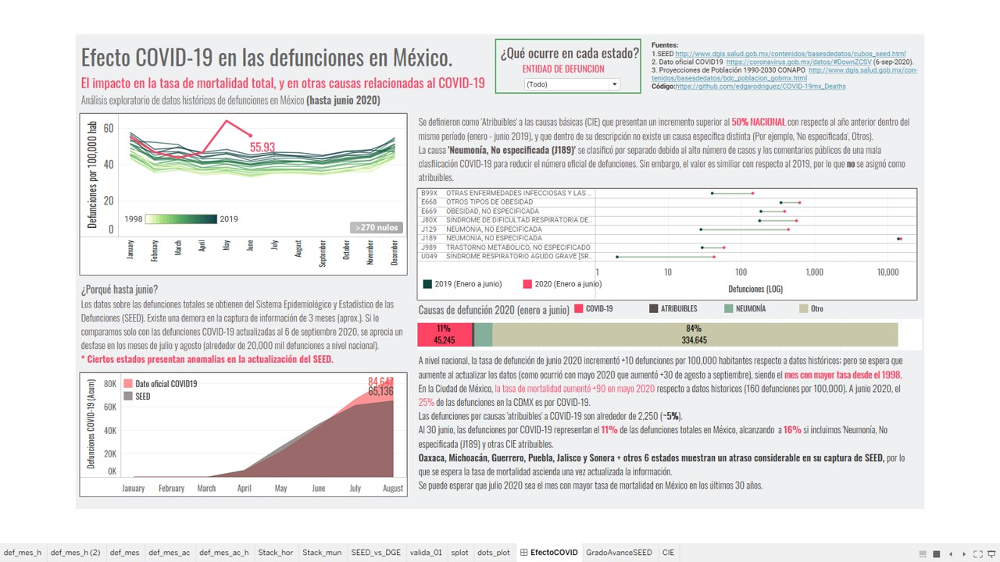

---
authors:

- admin
categories:
- Data Science

date: "2020-09-08"
draft: false
featured: false
diagram: true
image:
  caption: ''
  focal_point: ""
  placement: 2
  preview_only: true
lastmod: "2020-09-10T00:00:00Z"
projects: [COVID-19-MX]
tags:
- COVID-19
- Data visualization
- Tableau

# url_poster: ""

math: true
title: 'COVID-19 effect in mortality rates in Mexico'
subtitle: 'Relationship among other death causes'
summary: 'Exploratory analysis of death rates in Mexico 2020 (Update to September 2020).'

---

What is the effect of **COVID-19** on the death rate in **Mexico**? 
Is it true that deaths are classified with different causes to avoid an increase the number of cases?
I analyzed the information from the Epidemiological and Statistical System of Deaths (SEED) from 1998 to September 2020 to determine the increase in the mortality rate vs. the historical data.
Although there are several States with important delays in updating information *(especially: OAXACA, MICHOACÁN, GUERRERO, PUEBLA, JALISCO)*, in June 2020 the rate increased to almost 70 deaths per 100,000 inhabitants (30%). **Mexico City** almost tripled its rate (160 deaths per 100,000 inhabitants) compared to the same period, which represented that 1 of each 4 deaths in Mexico City is due to COVID-19. Until June 30, 2020[^fn1], COVID-19 caused 11% of total deaths in Mexico.

Around 2,300 deaths were detected with causes related to COVID-19, classified with another cause, mainly **J129 'Viral Pneumonia, Unspecified'** with around 300 more cases compared to the previous year.

[^fn1] It was defined until June 2020 due to the delay in the SEED data.

If you want to see the complete analysis, and how each State goes, [here is the interactive (in Spanish)](https://public.tableau.com/views/DefuncionesCOVID19-Mexico/EfectoCOVID?:language=en&:display_count=y&:origin=viz_share_link)

### Did you find this page interesting? Consider sharing it 🙌
