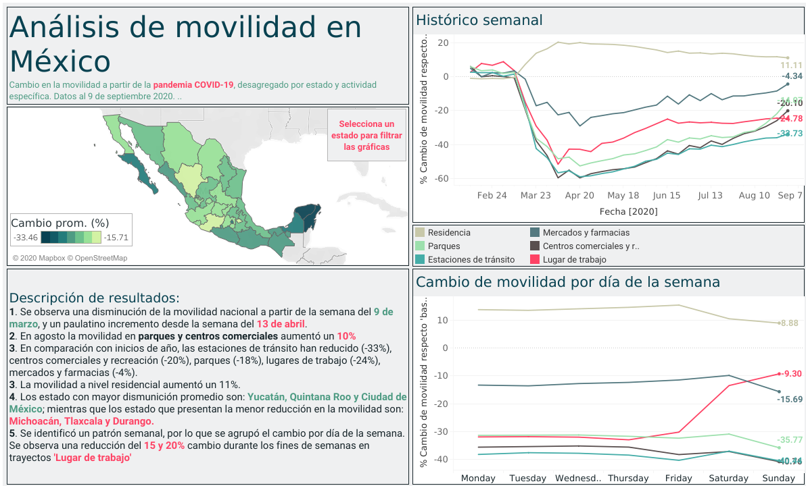

---
authors:

- admin
categories:
- Sustainability

date: "2020-06-05"
draft: false
featured: false
diagram: true
image:
  caption: ''
  focal_point: ""
  placement: 2
  preview_only: true
lastmod: "2020-09-08T00:00:00Z"
projects: [COVID-19-MX]
tags:
- COVID-19
- Data visualization
- Tableau

# url_poster: ""

math: true
title: Mobility in Mexico after COVID-19
subtitle: 'Analysis of the change in mobility pattern in Mexico due to COVID-19'
summary: 'Analysis of the change in mobility pattern in Mexico due to COVID-19'

---

Mobility has changed due to COVID-19. In Mexico, it decreased significantly in mid-March 9, but just a month later we observed a gradual recovery, especially in trips to workplaces.
In September 2020, mobility to workplaces has remained stable with -24%. However, mobility to parks and shopping centers increased 30% compared to last month, reaching the levels of March 2020. The increase in mobility may indicate a second significant wave and before the end of the first.

What is the relationship between mobility and the contagion rate in each region?
Why do states with the greatest reduction in mobility have high numbers of infections?

In general, all trips have decreased compared to the beginning of the year, but on weekends the reduction is less. What accounts for this difference?

If you want to see the complete analysis, and how each State goes, [here is the interactive (in Spanish)](https://public.tableau.com/views/AnlisisdemovilidadMxico/MovilidadMxico?:language=en&:display_count=y&:origin=viz_share_link)

### Did you find this page interesting? Consider sharing it 🙌
