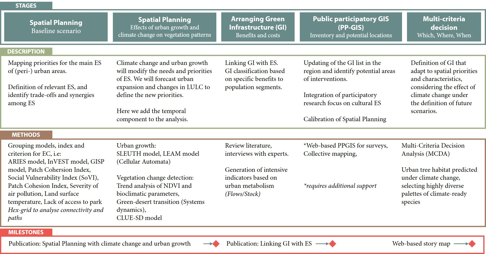

The benefits of Green Infrastructure (GI) in urban areas are massive, and are closely related to the ecosystem services (ES). GI improve the quality of life, mental and physical health, strengthen the sense of belonging, encourages the local social fabric, and reduce social vulnerability. Similarly, they decrease vulnerability and help mitigate the impacts of climate change [^fn1],[^fn2]. On the other hand, ecosystem service maps, are be essential tools to prioritize investments in GI, which will be developed as a network of natural areas, semi-natural areas and green spaces that contribute to biodiversity conservation and enhancement of ecosystem services [^fn3].
However, usually the locations of the projects are defined randomly, with a single purpose, or where there are particular benefits (such as gentrification) [^fn4]. How do we know that the planning and implementation of GI are located in the areas that enhance sustainability? Which initiatives will provide the greatest number of ecosystem services (for example, better air quality, access to green spaces, habitat connectivity)? Moreover, demographic and economic growth causes an unplanned and accelerated land use change, which will condition the capacity of ecosystem services
The aim of the project is to increase the benefits of green infrastructure, identifying priority ES in each area, and proposing nature-based solutions that fit better with to the circumstances of the location, which is not constant. Land-use/coverage change (LUCC) is expected due to climate change and urban growth. The proposal is related with two research flagships: “Integrated spatial modelling of land-use, water and air quality, integrating natural and social scientific model and data”, and “Climate change, mitigation and adaptation”.
The study can be broken down into 5 stages (Figure 1). In the first stage, we will carry out a spatial study of the requirements of the main ecosystem services, by compiling, adapting and applying different ES models. In the second stage, it will use systems dynamics models for analyzing the complex connection between LUCC and socioeconomic development to identify how region will change in the future. In the third stage, we will compare the different alternatives of green infrastructure based on the benefits they offer to ecosystem services, classifying by difficulty of implementation, size, type of vegetation, and population segment benefited. In the fourth section, we will encourage the Public participatory GIS (PP-GIS) to take an inventory of the current infrastructure, as well as to identify potential locations. At the same time, it will serve to integrate qualitative aspects such as cultural ecosystem services. Finally, with the result of the previous sections it is expected to generate a web-based tool for decision-making considering the spatial and temporal criteria, the characteristics and benefits of each type of green infrastructure.

**Figure 1: Workplan of GI·ES project**

[^fn1]: X. Chen et al., “Research challenges for cultural ecosystem services and public health in (peri-)urban environments,” Sci. Total Environ., vol. 651, pp. 2118–2129, 2019
[^fn2]: N. Kabisch, J. Stadler, H. Korn, and A. Bonn, “Nature-based solutions to climate change mitigation and adaptation in urban areas: perspectives on indicators, knowledge gaps, barries, and opportunities for action,” Ecol. Soc., vol. 21, no. 2, p. 39, 2016.
[^fn3]: J. Maes  Braat, L., Jax, K., Hutchins, M., Furman, E., Termansen, M., Luque, S., Paracchini, M.L., Chauvin, C., Williams, R., Volk, M., Lautenbach, S., Kopperoinen, L., Schelhaas, M., Weinert, J., Goossen, M., Dumont, E., Strauch, M., Görg, C., Dormann, C., A spatial assessment of ecosystem services in Europe: methods, case studies and policy analysis - phase 1. PEER (Partnership for European Environmental Research) Report No 3. . 2011.
[^fn4]: S. Meerow and J. P. Newell, “Spatial planning for multifunctional green infrastructure: Growing resilience in Detroit,” Landsc. Urban Plan., vol. 159, pp. 62–75, 2017.
